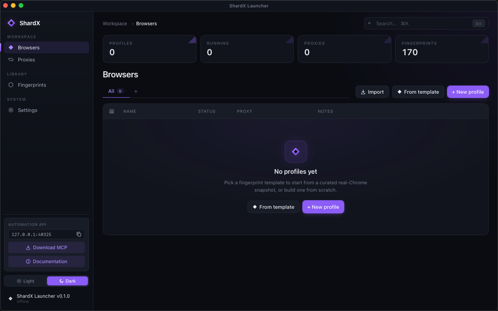
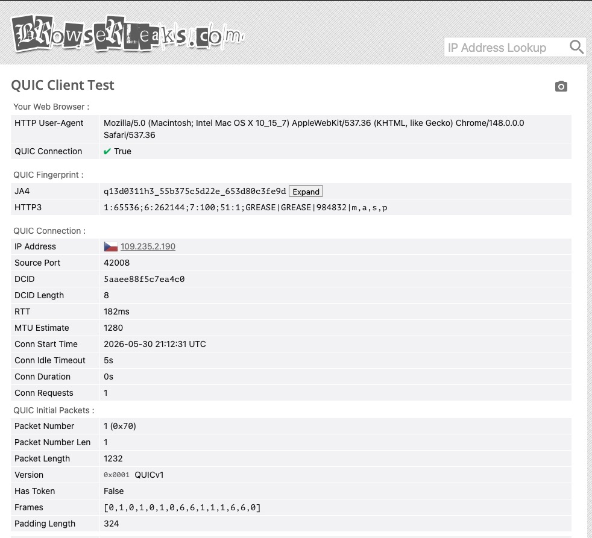
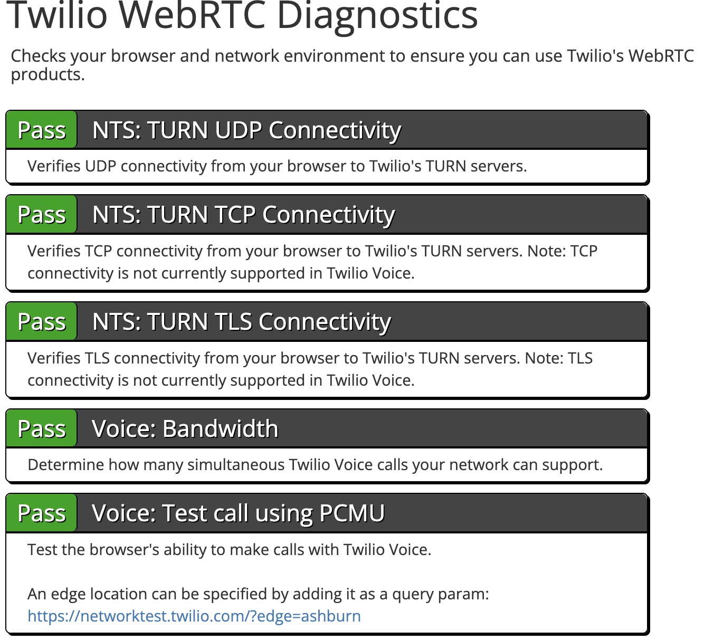
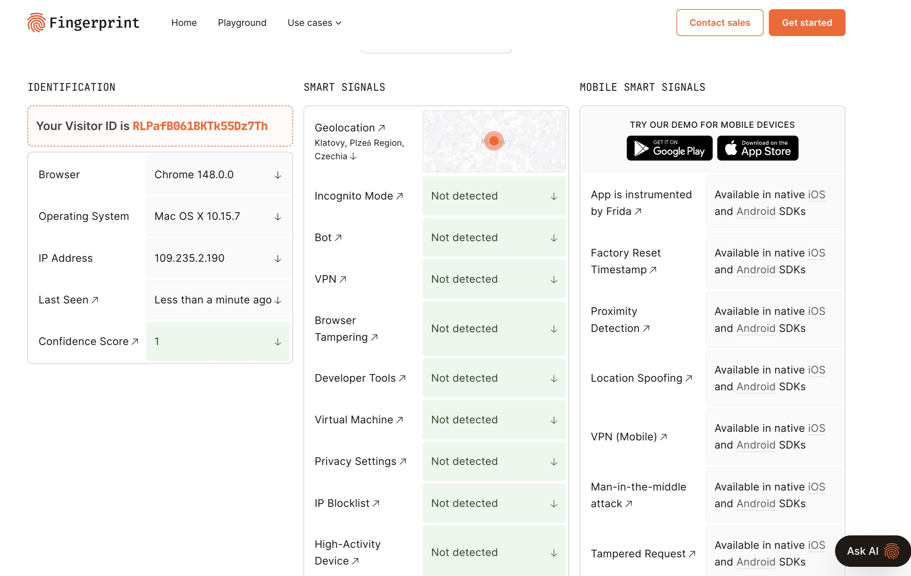
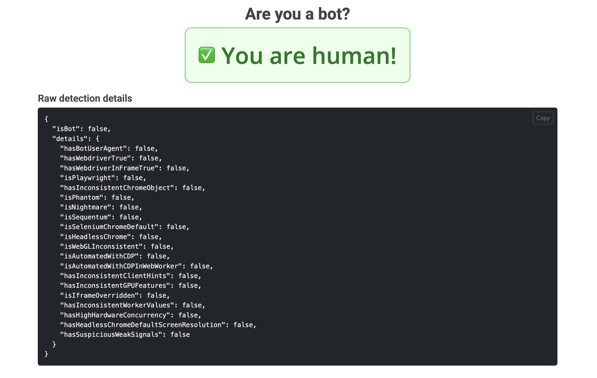
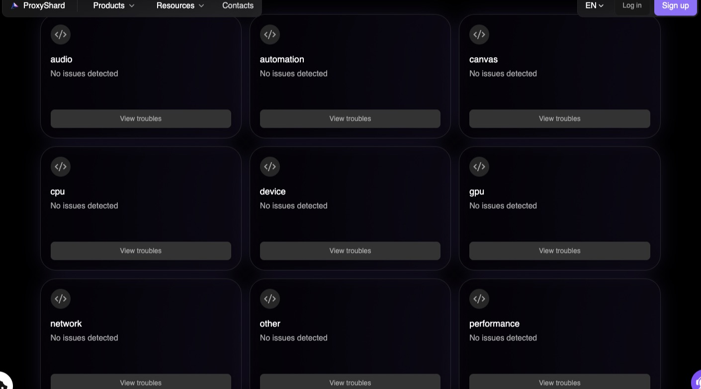
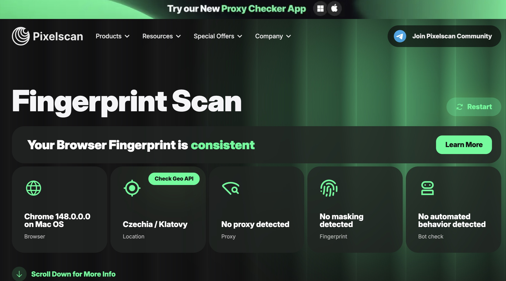
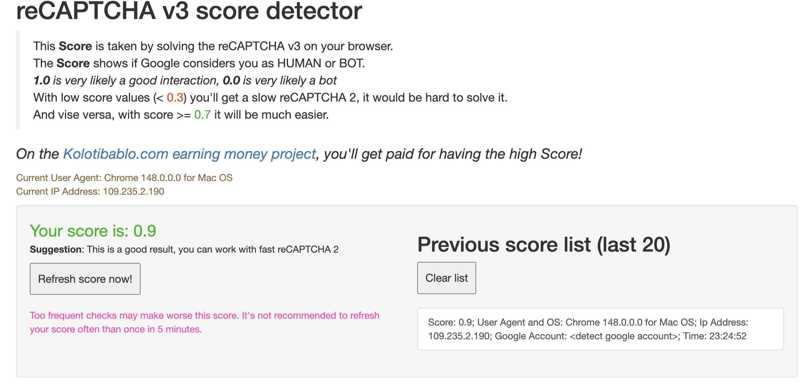

# ShardX Launcher

A project by the **[ProxyShard](https://proxyshard.com)** team — the
proxy service with full **SOCKS5 UDP relay** (RFC 1928 §7) and active
**p0f TCP-fingerprint spoofing** on the exit (so the OS the proxy
claims to be on actually matches the SYN/ACK shape sites see). ShardX
is the in-house anti-detect browser stack we built to get the most out
of those proxies: the launcher manages profiles, binds proxies, and
ships the patched **Chromium 148** browser that does the actual
spoofing at the engine level.

* **Site:**     <https://proxyshard.com>
* **Docs:**     <https://docs.proxyshard.com>
* **UDP info:** <https://docs.proxyshard.com/eng/our-products/about-udp>
* **p0f info:** <https://docs.proxyshard.com/eng/our-products/p0f-spoofing>

<p align="center">
  
</p>

---

## What it is

**A free, open-source anti-detect browser for web scraping and
multi-accounting.**

Run hundreds of isolated browser identities side by side, each one a
fully-formed device with its own GPU, screen, fonts, audio stack,
timezone, locale, WebGL/WebGPU caps, TLS ClientHello, UA-CH, WebRTC
policy, geolocation and cookies — every signal coherent with the
others, and every signal **spoofed inside Chromium's C++ engine**
(Blink / V8 / network stack), not via JS injection that detectors trip
on instantly.

You get 170 ready-made device profiles out of the box (mac M1–M5,
Windows desktops/laptops with RTX/GTX/Intel/AMD GPUs, Linux
workstations), bind a SOCKS5 / HTTP proxy to each one, and the
launcher handles the rest — auto-resolved timezone + locale +
geolocation from the proxy's exit country, isolated `user-data-dir`,
persistent cookies, Widevine pre-warm, QUIC over the proxy's UDP
relay, no real-IP leaks via WebRTC.

Free for any use — pair with [ProxyShard](https://proxyshard.com)
proxies for the QUIC + WebRTC stack to actually work end-to-end, or
bring your own.

What this gives you out of the box:

| Test                                                            | Result                                                                   |
|-----------------------------------------------------------------|--------------------------------------------------------------------------|
| [browserleaks.com/quic](https://browserleaks.com/quic)          | QUIC `True`, JA4 matches real Chrome, MTU 1232 over SOCKS5 UDP relay     |
| [fingerprint.com](https://fingerprint.com/demo)                 | Bot / VPN / DevTools / browser-tampering all `Not detected`              |
| [browserscan.net](https://www.browserscan.net)                  | Authenticity **100%**                                                    |
| [pixelscan.net](https://pixelscan.net)                          | Fingerprint **consistent**, no proxy / automation detected               |
| [fp.haru.gay](https://fp.haru.gay)                              | `isBot: false`, every sub-signal `false`                                 |
| [antcpt.com/score_detector](https://antcpt.com/score_detector/) | reCAPTCHA v3 score **0.9**                                               |
| [networktest.twilio.com](https://networktest.twilio.com)        | TURN UDP / TCP / TLS + Voice — all **Pass** (no real-IP leak)            |

---

## Fingerprint surfaces patched

All overrides live inside the browser engine — there is no JavaScript
shim layer that detectors can spot, so spoofed values are consistent
across iframes, web workers, devtools and headless inspection.

* **Device identity** — user agent, platform, vendor, CPU cores, RAM,
  touch points, full Sec-CH-UA stack (brand, version, architecture,
  bitness, mobile, model) with stable GREASE.
* **Graphics** — WebGL renderer / vendor / extensions / limits, WebGPU
  adapter + limits, deterministic per-profile noise for Canvas, DOMRect
  and ClientRects, color gamut and HDR claims.
* **Audio** — sample rate, channel count, optional per-profile noise on
  raw audio samples.
* **Screen & window** — full resolution + available area + DPR + color
  depth, max-size cap so the OS won't resize past the claimed
  dimensions.
* **Locale** — timezone, ICU locale, primary language and the
  Accept-Language header auto-derived from the bound proxy's country.
* **Geolocation** — coordinates either set manually or derived from the
  proxy's exit IP; host GPS / Wi-Fi is never used.
* **Network capability** — connection type, downlink, RTT, save-data,
  storage quota, JS heap limit, battery state, media-device counts.
* **TLS ClientHello** — Chrome-148 cipher + signature-algorithm
  selection, extension shuffling, so JA4 / Akamai / Peetprint fingerprints
  match real Chrome.
* **HTTP-3 over the proxy's UDP relay** — QUIC works end-to-end through
  SOCKS5; origin hostnames are resolved proxy-side.
* **WebRTC policy** — `block` / `tcp_only` / `auto`. In `auto` traffic
  rides the proxy's UDP relay; otherwise WebRTC candidates report the
  proxy exit IP, never the host. STUN / TURN targets on private
  networks are dropped.
* **Speech voices** — full per-OS `speechSynthesis.getVoices()`
  enumeration (200+ macOS voices, SAPI + Google for Windows, Google-only
  for Linux).
* **Fonts** — system font enumeration pinned to a per-profile set so
  font-list probes return the claimed device's fonts, not the host's.
* **WebGPU on Linux** — disabled to match what real Linux Chrome
  actually exposes (most distros ship WebGPU off).
* **Google validation headers** — the headers real Google Chrome adds to
  requests against Google properties (notably `x-client-data` — its
  absence is the loudest reCAPTCHA bot signal) are reproduced correctly.
* **WebAuthn** — platform-authenticator availability matches the
  claimed device.
* **Hardening** — Widevine pre-warmed per profile, headless markers
  stripped, devtools-protocol side-channels closed, sync hard-disabled,
  no keychain prompts, no Google account telemetry, no Privacy Sandbox
  enrollment data leaked.

---

## Launcher features

* **Profile workspace** — per-profile `user-data-dir`, persistent
  Chrome sessions ("Continue where you left off" without the
  crash-restore bubble), bulk import, folder / tag organisation, pin
  to top, clone.
* **Fingerprint library** — 170 starter profiles shipped via CDN
  (31 mac-arm64 / 120 windows-x64 / 19 linux-x64). Profile editor
  randomises CPU / RAM / platform-version when you change the GPU.
* **Proxy manager** — SOCKS5 / HTTP / HTTPS, bulk paste-import,
  per-proxy live test (TCP + UDP_ASSOCIATE probe + geo lookup), bind a
  proxy to a profile by id or inline-on-launch. Auto-resolves timezone
  / locale / geolocation from the proxy's exit country.
* **Auto-runtime** — first launch pulls the patched ShardX Chromium
  build, Widevine CDM and the fingerprint library from CDN, places
  Widevine inside the framework, persists an etag so subsequent
  launches are zero-network.
* **Local automation API** — axum HTTP server on `127.0.0.1`,
  JWT-Bearer auth. Full reference at
  [docs.proxyshard.com/eng/shardx-launcher-api](https://docs.proxyshard.com/eng/shardx-launcher-api/binding-and-lifecycle?fallback=true),
  raw schema in [openapi.yaml](openapi.yaml). Create / start / stop
  profiles and get a CDP WebSocket URL programmatically.
* **MCP server bundled** — drop into Claude Desktop / IDE for
  natural-language profile orchestration.
* **Cookie I/O** — import / export the profile's Chromium Cookies
  SQLite with v10 (mac / linux) and AES-GCM + DPAPI (win) decryption.
* **Cross-platform** — macOS arm64, Windows x64, Linux x64; native
  traffic lights on mac, custom titlebar elsewhere.

---

## Screenshots

### Network — QUIC + WebRTC over SOCKS5

QUIC handshake completes end-to-end through the SOCKS5 UDP relay;
every WebRTC probe (UDP / TCP / TLS) passes against Twilio's test
suite without leaking the host IP.

| browserleaks.com/quic — QUIC `True`, JA4 matches Chrome 148 | networktest.twilio.com — every probe `Pass`               |
|-------------------------------------------------------------|------------------------------------------------------------|
|           |            |

### Bot / automation detection

| fingerprint.com — Bot / VPN / DevTools / tampering `Not detected` | fp.haru.gay — `isBot: false`, every signal `false`     |
|-------------------------------------------------------------------|---------------------------------------------------------|
|                     |         |

### Fingerprint consistency

| ProxyShard's own browser-checker — no issues across 9 categories | pixelscan.net — Fingerprint **consistent**             |
|-------------------------------------------------------------------|---------------------------------------------------------|
|          |          |

### Authenticity score

| browserscan.net — Authenticity 100 %, locale honoured     | antcpt.com — reCAPTCHA v3 score **0.9**                    |
|-----------------------------------------------------------|------------------------------------------------------------|
|        |       |

---

## Comparison with other anti-detect browsers

All three are patched Chromium forks — the differentiation is in *which*
surfaces each one bothers to patch, *how cleanly*, and what's wrapped
around the engine.

| Feature                                                       | ShardX (this project)        | CloakBrowser                 | Multilogin / AdsPower / Dolphin                |
|---------------------------------------------------------------|------------------------------|------------------------------|------------------------------------------------|
| WebGPU spoofing (`navigator.gpu` adapter + every limit)       | ✅ full                       | ❌ untouched — host GPU leaks | ✅ full                                         |
| Client Hints (Sec-CH-UA-* full stack with GREASE)             | ✅ full                       | ❌ partial / inconsistent     | ✅ full on Multilogin / AdsPower, ❌ Dolphin     |
| Font enumeration pinned per profile                           | ✅ system-level               | ❌ JS-only, host fonts still leak via CSS / canvas font-render | ⚠️ partial          |
| V8 / CDP side-channel hardening (preview-getters, inspector)  | ✅ closed                     | ❌ open — CDP automation detectable | ⚠️ partial                                |
| TLS ClientHello fingerprint (JA4)                             | ✅ matches real Chrome 148    | ⚠️ static / drifts on uprev   | ✅ matches the forked Chrome version            |
| QUIC / HTTP-3 over SOCKS5                                     | ✅ stable end-to-end via UDP relay | ⚠️ implemented but unstable — falls back to TCP / drops mid-session | ❌ disabled when proxy is set |
| WebRTC over SOCKS5 (no real-IP leak via STUN)                 | ✅ proxy UDP relay or synth candidates | ⚠️ same UDP relay path, same instability | ⚠️ disable-only            |
| Consistency of generated profiles                             | ✅ coherent device (GPU ↔ CPU ↔ RAM ↔ UA ↔ fonts) | ❌ frequent contradictions (Win UA + Mac GPU, mobile UA + desktop screen, etc.) | ⚠️ varies |
| Bundled fingerprint library                                   | 170 real-device profiles      | ❌ random generator — incoherent fingerprints (Win UA + Mac GPU, mobile UA + desktop screen, etc.) | catalog (subscription) |
| Pricing                                                       | **Free** — only proxy costs   | **Free** — engine only        | Paid / freemium                                |
| Management UI                                                 | ✅ desktop app (this launcher) | ⚠️ CLI only — no GUI, profiles managed by hand / scripts | ✅ desktop app                |
| Launcher source                                               | **Open** (MIT, this repo)     | **Open** (CLI)                | Closed                                         |

### Why this matters in practice

Public "is my browser human?" checkers — fingerprint.com,
pixelscan.net, browserscan.net, fp.haru.gay, antcpt's reCAPTCHA score
detector — generally don't bother to probe most of the surfaces below,
so an anti-detect that fails any of them can still light up all green
on those pages and feel like everything's fine.

Real production anti-fraud stacks (the ones banks, marketplaces, ad
networks, ticketing sites, online betting and dating platforms run)
do check them, and the gap is exactly where accounts get flagged a
few sessions in instead of immediately:

* `navigator.gpu.requestAdapter()` returns the **host** GPU on
  CloakBrowser, so a profile claiming an RTX 4060 on Windows leaks the
  Mac M-series adapter underneath. ShardX (and the paid anti-detects)
  return the claimed GPU with full WebGPU limits.
* CDP wrappers, V8 inspector preview-getters and `Object.toString`
  side-channels are wide open on CloakBrowser and only partially closed
  on the paid anti-detects. ShardX patches close every documented side
  channel — automation stays invisible.
* Font lists scraped via canvas font rendering or
  `document.fonts.check()` return the **host** font list on
  CloakBrowser no matter what the profile claims. ShardX pins the font
  enumeration at the system level so the result matches the device.
* CloakBrowser's profile generator routinely emits incoherent
  fingerprints (Win32 platform with macOS user-agent, mobile UA with
  1920×1080 screen, RTX GPU with `hardwareConcurrency=2`). ShardX's
  library is derived from real-device samples so every signal agrees
  with the others.
* QUIC / HTTP-3 over SOCKS5 is the new normal — major Google
  properties refuse to fall back to HTTP/2 cleanly. The paid
  anti-detects disable QUIC entirely the moment a proxy is set;
  CloakBrowser implements UDP relay but it drops mid-session.
  ShardX rides the proxy's UDP relay end-to-end so HTTP/3 stays up.

---

## Quick start

### Option A — grab a pre-built release

Download the build for your OS from
[GitHub Releases](../../releases) — `.dmg` for macOS, `.msi` for
Windows, `.AppImage` / `.deb` for Linux — and run it.

The release isn't code-signed (no Apple Developer ID, no Authenticode
cert), so the first launch is gated by the OS:

* **macOS** — Gatekeeper sees an unsigned bundle that the browser
  just downloaded and refuses to open it. Depending on macOS version
  you get either *"can't be opened because Apple cannot check it for
  malicious software"* (mild) or *"ShardX Launcher is damaged and
  can't be opened. Move it to the Trash."* (loud, since macOS 14+).
  **Both are fixed by stripping the quarantine attribute** the
  browser stamped on the .dmg — run once in Terminal:
  ```bash
  xattr -dr com.apple.quarantine "/Applications/ShardX Launcher.app"
  ```
  After that the .app opens normally with a double-click. If you only
  see the mild "developer cannot be verified" warning, right-click on
  the .app → *Open* → *Open* in the confirmation also works.
* **Windows** — SmartScreen shows *"Windows protected your PC"*.
  Click **More info** → **Run anyway**. Repeated launches don't
  re-prompt.
* **Linux** — `.AppImage`: `chmod +x ShardX-Launcher.AppImage && ./ShardX-Launcher.AppImage`. `.deb`: `sudo apt install ./ShardX-Launcher.deb`.

### Option B — build from source

```bash
cd rust/shardx-launcher
npm install
npm run tauri dev      # dev (hot reload)
# or
npm run tauri build    # release .app / .msi / .AppImage in src-tauri/target/release/bundle/
```

### First launch

The app downloads the patched browser (~150 MB), Widevine (~16 MB) and
the fingerprint library (~470 KB) from our CDN, places everything
under

* `~/Library/Application Support/shardx-launcher/` (mac)
* `%APPDATA%\shardx-launcher\` (win)
* `~/.config/shardx-launcher/` (linux)

and you're ready to bind a proxy and launch your first profile.

---

## Licensing

The **launcher** (everything in this `rust/shardx-launcher/` directory
— Tauri shell, React UI, Rust source) is open source under the **MIT
License** — see [LICENSE](LICENSE). Use it, fork it, modify it, ship
it, commercially or otherwise.

The **browser engine** (the patched Chromium 148 binary that the
launcher downloads from our CDN on first run) is distributed as a
**closed-source binary**. Its source is not published in this
repository or elsewhere, and the following are explicitly **not
permitted**:

* reverse engineering, disassembly, decompilation, or any attempt to
  extract or reconstruct the engine source;
* redistributing a modified version of the engine;
* using the engine — or any binary derived from it, with or without
  modification — as part of a commercial anti-detect / browser /
  fingerprint-spoofing product or service.

Personal use, web scraping, multi-accounting and integration with the
launcher's automation API are all fine. If you want to build something
commercial on top of the engine, contact us first.
